# Islam 313 – Mobile Application (Android & iOS)

Islam 313 is a cross-platform mobile application built to provide Islamic community updates, announcements, and utilities through a modern, scalable mobile architecture. The app is designed for both **Android and iOS**, with a strong focus on reliability, real-time communication, and ease of use.

📱 **Android App (Live on Play Store):**  
https://play.google.com/store/apps/details?id=org.zydenlabs.islam313  

🍎 **iOS App:**  
Currently under review and will be available on the App Store soon.

---

## 📖 Project Overview

Islam 313 is a **Kotlin Multiplatform (KMP)** based application that allows users to stay connected with announcements, notifications, and religious utilities. The application supports real-time content delivery, multimedia announcements, and scheduled notifications, making it suitable for community-driven use cases.

The app is built with **scalability, maintainability, and cross-platform consistency** in mind.

> ⚠️ This repository is a **project showcase only**.  
> Source code is private and not shared.

---

## 🧩 Application Architecture

- **Frontend**
  - Kotlin Multiplatform (KMP)
  - Compose Multiplatform
  - Native Android & iOS UI layers

- **Backend & Services**
  - Firebase Authentication
  - Firebase Cloud Messaging (FCM)
  - Firebase Firestore
  - Firebase Storage
  - Google AdMob

---

## 🔐 Authentication

- Phone number authentication using **Firebase Auth**
- Supported on **both Android and iOS**
- Secure OTP-based login flow
- Seamless user onboarding experience

---

## 🧭 Core Features

### 1️⃣ Compass Feature
- Built-in compass functionality
- Helps users determine direction accurately
- Optimized for smooth sensor handling

---

### 2️⃣ Announcements System
- Admin can create and manage announcements
- Users receive announcements in real time
- Supports rich content formats:
  - Text
  - Images
  - Audio files
  - Audio recording
  - PDF documents

---

### 3️⃣ Create Announcement (Admin)
- Upload images directly from device
- Record audio or upload audio files
- Upload PDF documents
- All content securely stored using Firebase Storage

---

### 4️⃣ Push Notifications
- Integrated **Firebase Cloud Messaging (FCM)**
- Real-time notification delivery
- Scheduled notifications for announcements and reminders

---

### 5️⃣ Ads Integration
- Integrated **Google AdMob**
- Optimized ad placements for user experience
- Supports banner and interstitial ads

---

## 📸 Application Screenshots

> Screenshots are stored inside the **screenshots/** directory

 
> Login, Home

 
  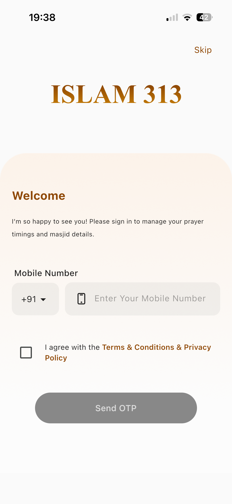 
  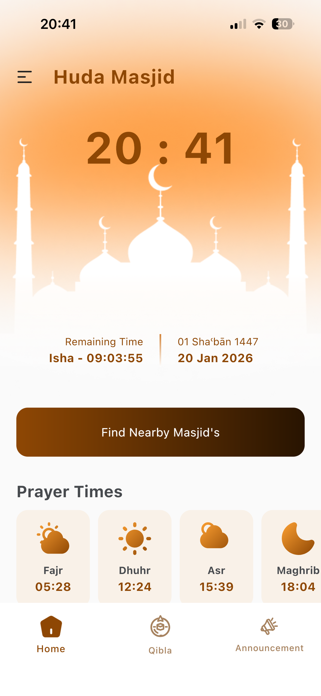 
  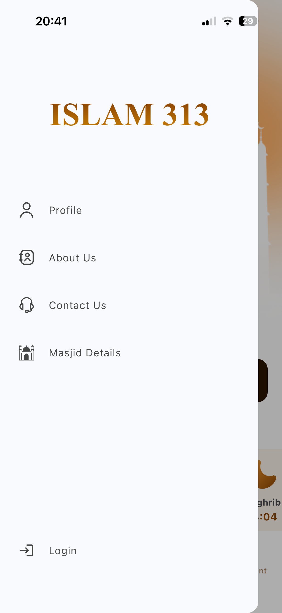

> Location, Masjid Details, Compass

  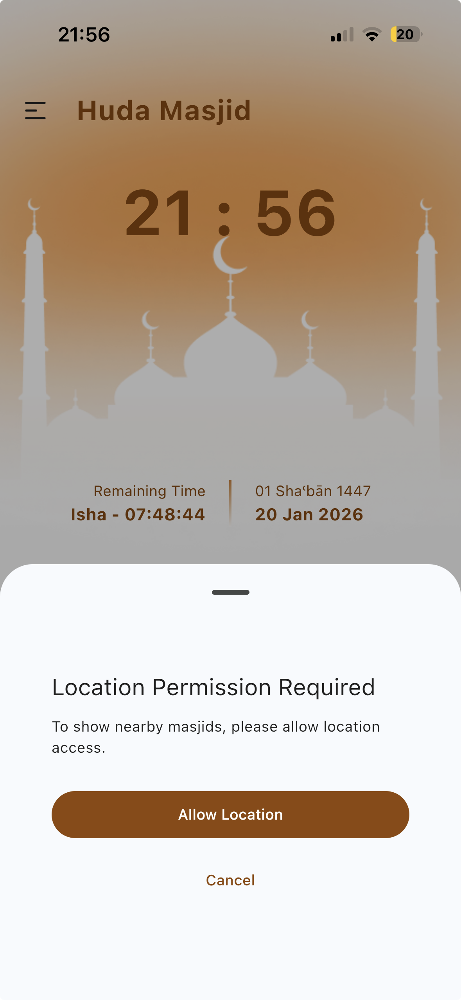 
  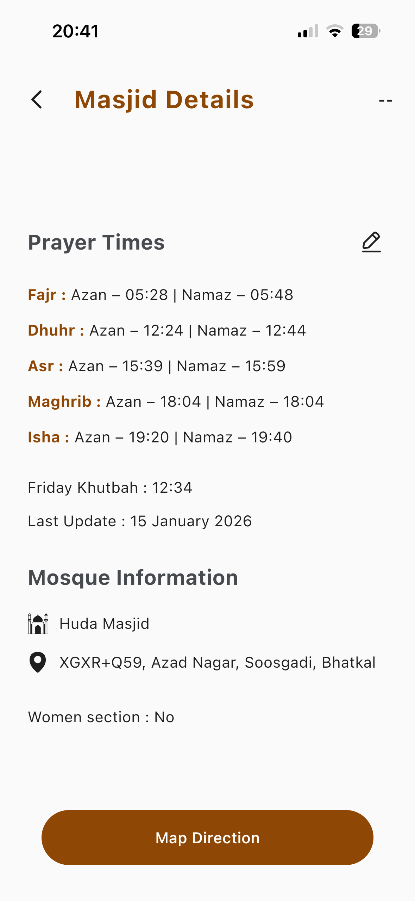
  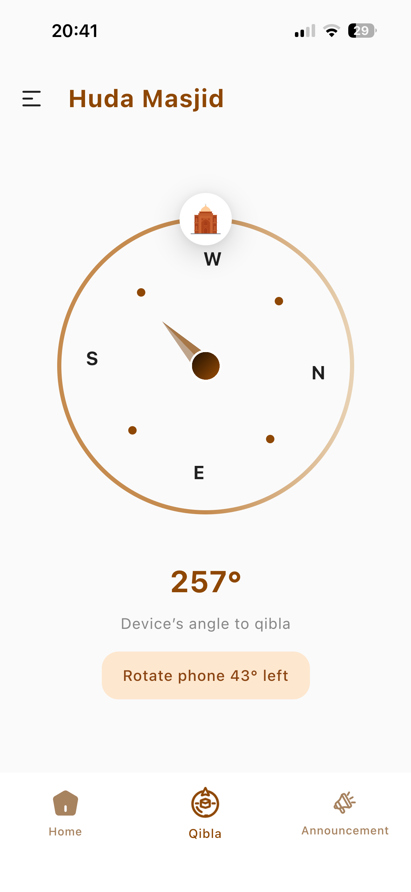

> Announcement Create and Show

  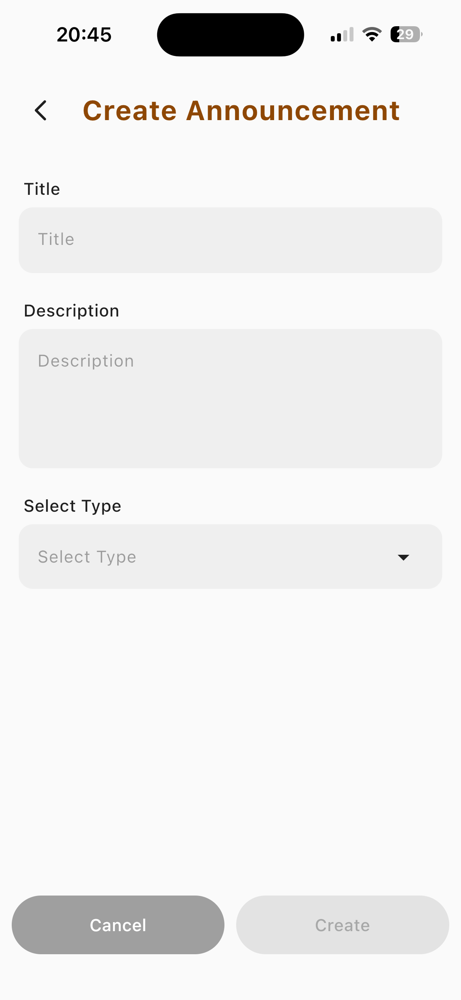 
  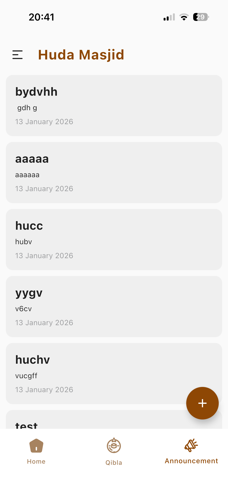

> Audio Recode, Pick Image and Docs and Upload to server

  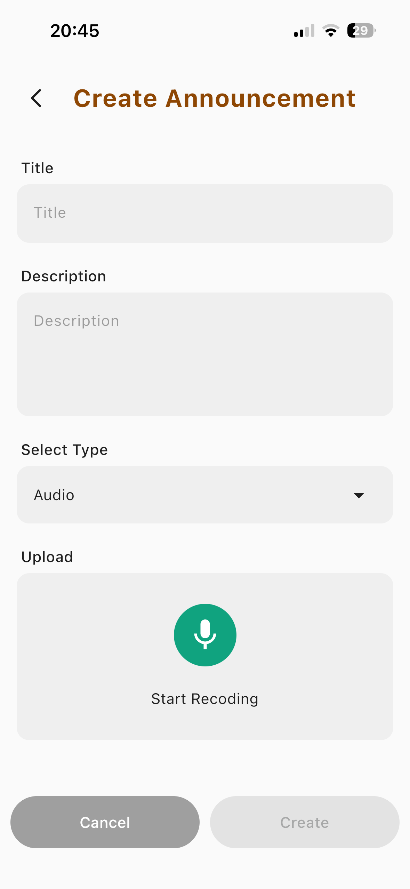 
  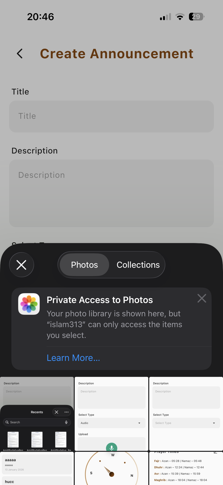
  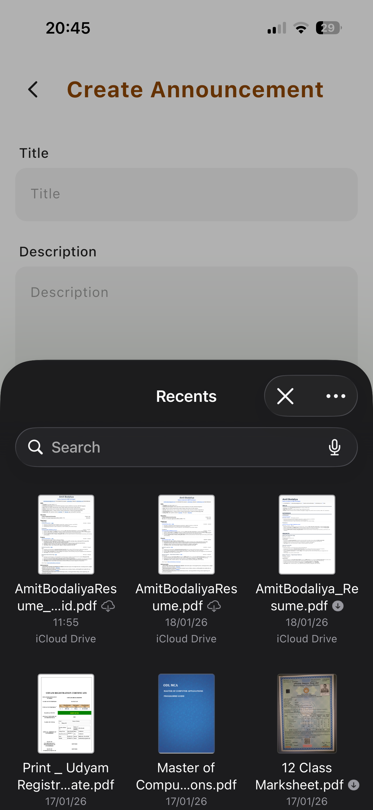

 

## 🌍 Platform Availability

- ✅ **Android:** Live on Play Store  
- 🚧 **iOS:** App Store submission in progress

---

## 🏢 Client Information

**Client / Organization:** Islam 313  
🌐 **Official Website:** *(Link to be added)*  

This application was developed for the organization’s official use to manage announcements and community communication.

---

## ⭐ Client Testimonial

> *Client testimonial*  
> — **Add Soon**

---

## 👨‍💻 Developer

**Developed by:** Amit Bodaliya  
🌐 **Portfolio:** https://amitbodaliya.com  

This project was independently designed and developed, covering architecture, development, integration, and deployment.

---

## ⚠️ Disclaimer

This repository is for **portfolio and project showcase purposes only**.  
Source code, internal logic, and backend configurations are private and protected.

---

## 📬 Contact

For application details, collaboration, or custom development inquiries, feel free to connect via my portfolio or LinkedIn.

